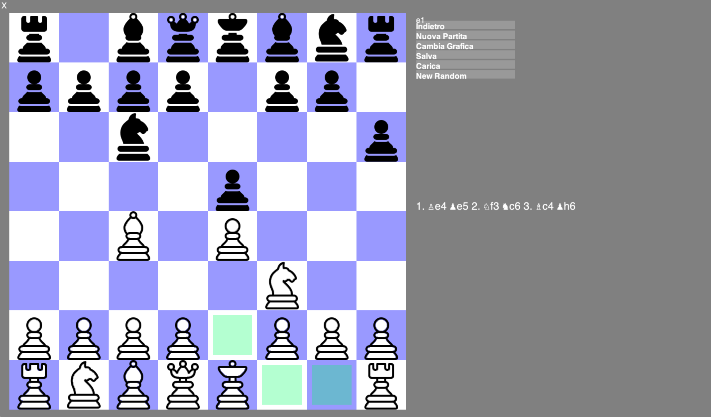
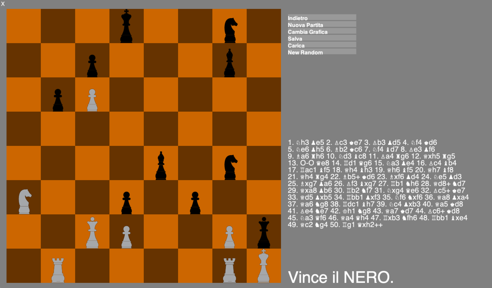

# Chess

Python implementation of chess game.
Features:
- Save and load games in Portable Game Notation (`.pgn`)
- p vs p mode
- p vs AI (future feature)
- Simulation of random match
- More possibilities for the graphic
- Check legal move (considering also _en passant_ ecc...)
- Check End (win - draw - lose)
- Revert move

